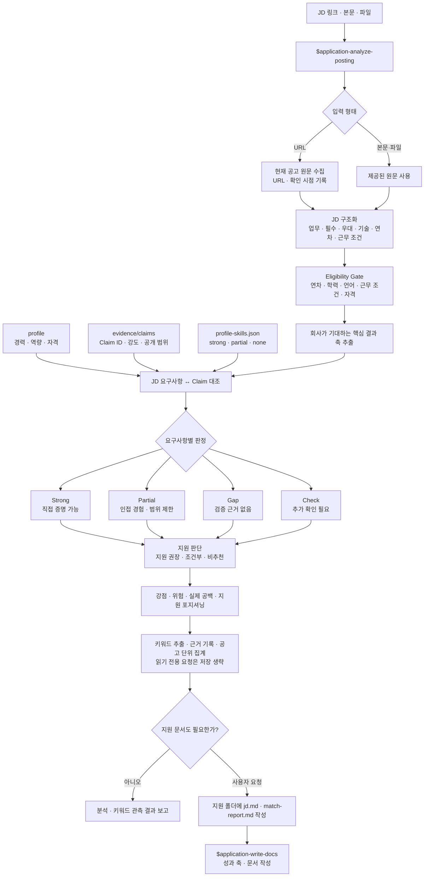

# Analyze JD Fit Flow

## 한눈에 보기

```text
JD 링크 · 본문 · 파일
          │
          ▼
  $application-analyze-posting
          │
          ├─ URL ───────► 현재 공고 원문 수집
          │               URL · 확인 시점 기록
          │
          └─ 본문·파일 ─► 제공된 원문 사용
                          │
                          ▼
                    JD 구조화
        업무 · 필수 · 우대 · 기술 · 연차 · 근무 조건
                          │
                          ▼
                  Eligibility Gate
          연차 · 학력 · 언어 · 근무 조건 · 자격
                          │
                          ▼
                  핵심 결과 축 추출
                          │
             ┌────────────┼────────────┐
             ▼            ▼            ▼
          profile    evidence/claims   profile-skills
        경력·역량·자격  Claim ID·강도    strong·partial·none
             └────────────┼────────────┘
                          ▼
                 요구사항 ↔ Claim 대조
                          │
             ┌────────────┼────────────┬────────────┐
             ▼            ▼            ▼            ▼
           Strong       Partial       Gap          Check
         직접 증명     인접 경험    근거 없음    추가 확인
             └────────────┼────────────┴────────────┘
                          ▼
                     지원 판단
             지원 권장 · 조건부 · 비추천
                          │
                          ▼
       강점 · 위험 · 실제 공백 · 지원 포지셔닝
                          │
                          ▼
              키워드 추출 · 관측 저장 · 집계
                 (읽기 전용 요청은 저장 생략)
                          │
                     지원 문서 필요?
                    ┌─────┴─────┐
                  아니오         예
                    │            │
                    ▼            ▼
             관측 결과 보고   jd.md · match-report.md
                             → $application-write-docs
```

## Mermaid



## 실행 경계

- `$application-analyze-posting`은 현재 실행 중인 agent와 repo의 canonical source로 분석한다.
- 외부 LLM을 호출하지 않는다.
- 기본 실행은 [키워드 계약](../../../../wiki/products/jd/keyword-analysis.md)에 따라 정규화 관측과 파생 보고서만 저장한다. 읽기 전용 요청은 저장하지 않는다.
- 홈페이지, `/chat`, API, 지원 기록은 변경하지 않는다. JD 원문은 지원 폴더 모드의 `jd.md`에만 저장한다.
- 지원 문서 제작은 사용자가 요청할 때만 `$application-write-docs`로 넘긴다.
