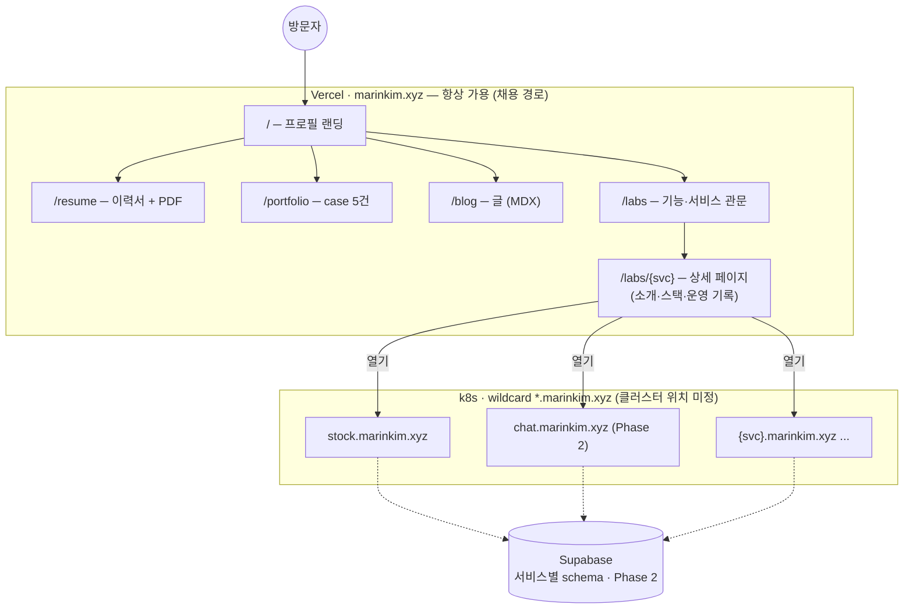
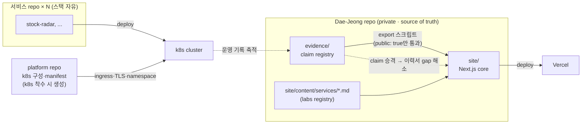

# Personal Site Architecture Design

## Status

- 2026-07-15 설계 확정. 구현 착수는 보류 — Phase 1 시작 시 Tier 2 상세(패키지 매니저, Vercel 설정, export 스크립트 사양)는 task 문서로 분리한다.
- 2026-07-15 당일 개정: 도메인 `marinkim.xyz` 확정, 기능 runtime을 k8s로 확장(클러스터 위치 미정), Supabase 역할을 기능 데이터 층으로 한정, 핵심 경로 불변 조건 추가.
- 2026-07-15 2차 개정: 서비스 프레임워크 확정 — services registry + service contract, `{svc}.marinkim.xyz` 평면 subdomain, 서비스당 repo + platform repo 배치.
- 2026-07-15 3차 개정: `/labs` 디렉토리 신설 — hub를 `/blog`(글)와 `/labs`(기능·서비스 관문)로 분리, 서비스 상세는 `/labs/{svc}`.
- 2026-07-17 4차 개정: 내장/외부 경계 확정 — **site 내장 = core 페이지 + visitor chat + jarvis** (Vercel serverless로 감당), **labs 서비스 = 전부 외부 repo + subdomain** (site는 registry 라우팅만). k8s는 외부 labs 서비스 전용.
- 2026-07-17 5차 개정: 이 repo를 **프로젝트 repo**로 확장 — harness + `site/`(Next 한방: FE+serverless BE) + `infra/`(도메인·Vercel 구성, k8s 착수 시 클러스터·외부 서비스 manifest까지). **별도 platform repo 결정을 대체** — 외부 labs 서비스는 코드만 각자 repo, manifest는 `infra/`가 소유 (GitOps config-repo 패턴).
- 2026-07-17 6차 개정: **jarvis backend 분리** — jarvis는 UI(site 내장)와 전용 backend(`be/`, FastAPI)로 구성하고 backend는 **Render free tier로 배포** (wiki 인덱싱·RAG·대화 메모리 등 serverless 부적합 워크로드). visitor chat은 site serverless 유지. 제약 반영: Render cold start 30~60초(웜업 UX 필요), 상태는 전부 Supabase pgvector(Render Postgres 사용 금지, `wiki:pricing/render`).
- [Visitor Profile Chat 설계 (2026-07-04)](2026-07-04-visitor-profile-chat-homepage-prototype-design.md)의 스택 결정을 승계하고, repo 배치·정보 구조·확장 계약을 확정한다.

## Decisions

| Decision | Rationale |
| --- | --- |
| 사이트 코드는 이 repo `site/`에 둔다 | 콘텐츠와 사이트가 함께 진화하고 별도 repo sync 단계가 사라진다. 외부 repo에서 만든 기능은 blog 기능 폴더로 이식한다. 분리가 필요해지면 폴더 추출 비용이 낮다. |
| 스택: Next.js + Fumadocs + assistant-ui + Vercel AI SDK | 2026-07-04 설계 승계. |
| 핵심 사이트 배포: Vercel (Root Directory=`site`) + `marinkim.xyz` | 채용 담당자가 보는 경로는 zero-ops로 항상 살아 있게 한다. |
| 기능 runtime은 k8s — 클러스터 위치는 착수 시 결정 | ops 기록 자체가 산출물이다. gap-map 1위 공백(Kubernetes)을 메우는 production case가 되고, 운영 증거가 쌓이면 claim registry로 승격한다. |
| 핵심 경로 불변 조건 | `/`·`/resume`·`/portfolio`·`/blog`·`/labs`는 Vercel에 남는다. k8s 장애 시 `/labs` 카드만 "점검 중"으로 강등되고 이력서·포폴·상세 페이지는 영향받지 않는다. |
| Supabase는 기능 데이터 층만 (Phase 2 도입) | chat 기록·방문 로그 등 기능 데이터의 공용 Postgres/auth/storage. profile 콘텐츠는 git 파생 정적을 유지한다 — 이중 소스 금지. |
| 서비스 프레임워크 = registry + contract | 미래 서비스를 모르는 채로 확장 비용을 고정한다. 기계(공용 SDK·템플릿)가 아니라 규약이 프레임워크다. |
| subdomain은 `{svc}.marinkim.xyz` 평면 | wildcard `*.marinkim.xyz` → k8s ingress, apex/www → Vercel. DNS record 하나로 서비스 추가가 끝난다. |
| 서비스당 repo 하나 + `infra/`가 manifest 소유 (5차 개정) | 서비스 코드는 각자 repo(스택 자유), k8s 클러스터 구성·manifest는 이 repo `infra/`가 소유 (기존 별도 platform repo 결정 대체). Dae-Jeong repo = harness + `site/` + `infra/` + registry의 프로젝트 repo. |
| 정보 구조: `/`, `/resume`, `/portfolio`, `/blog`, `/labs` | 이력서·포트폴리오·블로그·labs 4용도. 랜딩은 마케팅 페이지가 아니라 프로필 요약 + 진입. |
| `/blog`는 글, `/labs`는 기능·서비스 관문 | labs 묶음을 subdomain이 아니라 core 페이지로 표현한다. 서비스는 root-path subdomain을 유지해 서비스별 설정 비용 0을 지키고, `/labs`가 카드·상세 페이지로 routing한다. (3차 개정 — 기존 "글+기능 통합 hub" 결정을 대체) |
| 사이트는 knowledge harness의 consumer | 이력서·포폴 콘텐츠는 파생 전용이며 사이트에서 직접 수정하지 않는다. blog만 사이트 네이티브. |

## Content And Safety Boundary

```text
profile/ evidence/ products/  (private evidence 포함)
        │
        └─ export 스크립트: public: true claim·public-safe 산출물만 필터
                ↓ (수동 실행, release 시)
site/content/{resume,portfolio} + site/public/resume.pdf
site/content/blog  ← 네이티브 작성 (public-safety 체크리스트 적용)
```

- site 코드는 `site/` 밖의 repo 경로를 import·read하지 않는다. 콘텐츠 유입 경로는 export 스크립트 하나다.
- blog 글이 회사 사실을 다루면 [public-safety](../../../rules/public-safety.md)와 claim 상한을 그대로 적용한다. 체크리스트를 export pack에 포함한다.
- ⚠️ Vercel은 private repo 전체에 접근한다. 번들에는 site가 참조한 것만 포함되지만, 경계 규칙 위반이 곧 유출이므로 위 규칙을 리뷰 대상으로 삼는다.

## Deployment Composition

```text
marinkim.xyz, www     → Vercel (Next.js core) — 핵심 경로, 항상 가용
{svc}.marinkim.xyz    → k8s ingress — 서비스별 1단 subdomain (wildcard *.marinkim.xyz)
Supabase              → 기능 공용 데이터 층, 서비스별 schema 분리 (Phase 2)
```



## Route Structure

```text
site/
├── app/
│   ├── page.tsx                # / — 프로필 요약 + resume·portfolio·blog 진입
│   ├── resume/                 # 기존 responsive resume.html 재사용 + PDF 다운로드
│   ├── portfolio/
│   │   ├── page.tsx            # case 목록
│   │   └── [case]/             # 파생 MDX case 상세
│   ├── blog/
│   │   ├── page.tsx            # 글 목록
│   │   └── [slug]/             # MDX 글
│   ├── labs/
│   │   ├── page.tsx            # 기능·서비스 관문 (registry 렌더)
│   │   ├── [svc]/              # 상세 페이지 → {svc}.marinkim.xyz "열기"
│   │   └── {feature}/          # site 내장 경량 기능의 자립 폴더
│   └── api/                    # Phase 2 chat 등 발생 시
├── content/                    # resume/portfolio는 파생 전용, blog는 네이티브
├── public/resume.pdf           # 파생 artifact
└── lib/                        # 두 번째 사용처가 생긴 것만 승격
```

## Hub Contract

- `/blog`는 `post`(MDX 글) 목록만 다룬다.
- `/labs`는 registry 기반 관문이다. entry는 두 종류: `feature`(site 내장 경량 기능), `service`(독립 subdomain 서비스 — 아래 Service Framework를 따름). 상세 페이지는 `/labs/{id}`.
- 내장/외부 경계 (2026-07-17 확정): **visitor chat과 jarvis는 site 내장**이다 (라우트 상세는 착수 시 확정 — `/chat`, `/jarvis` 또는 labs feature). **`/labs`의 `service`는 전부 외부 repo에서 개발·배포**하며 site는 카드·상세·링크 라우팅만 담당한다.
- 내장 기능 하나 = `site/app/labs/{feature}/` 자립 폴더. route·UI·server 코드를 동봉하고 다른 기능을 import하지 않는다.
- 목록은 entry metadata(title, kind, date, status)만 읽는다.
- 공용화는 두 번째 사용처가 생길 때만 `site/lib/`로 승격한다.

## Service Framework

미래 서비스를 모르는 상태가 전제이므로, 프레임워크는 기계가 아니라 규약이다.

### Service Contract

1. 서비스 하나 = 이름 하나 = `{svc}.marinkim.xyz` = repo 하나 = k8s namespace 하나 = Supabase schema 하나.
2. `site/content/services/{svc}.md` 하나 등록하면 사이트 노출 끝 — `/labs` 카드와 `/labs/{svc}` 상세 페이지가 frontmatter·본문에서 생성된다.
3. 서비스 간 직접 호출 금지. 필요가 생기면 그때 계약을 추가한다.
4. `status: live | wip | paused`는 registry에서 수동 관리부터. health check 자동화는 발생 시.
5. 공용 추출(템플릿·SDK)은 서비스 두 개 이상에서 같은 패턴이 반복될 때만.

### Registry Entry

```yaml
# site/content/services/{svc}.md frontmatter
id: stock-radar
title: Stock Radar
url: https://stock.marinkim.xyz
repo: github.com/Dae-Jeong/stock-radar   # optional
status: wip
summary: 한 줄 소개
# 본문 = 상세 페이지 (동기·스택·스크린샷·운영 기록)
```

### 서비스 추가 절차 (접점 3개 고정)

1. 서비스 repo 생성·개발 (스택 자유)
2. platform repo에 k8s manifest 추가 — ingress·TLS는 wildcard로 자동
3. registry 파일 추가 — `/labs` 카드·상세 페이지 노출

core 사이트 코드는 건드리지 않는다. 서비스 상세 페이지와 운영 기록은 evidence로 축적되어 claim 승격 경로(k8s 등 gap 해소)에 연결된다.



## Phases

| Phase | Scope | Exit condition |
| --- | --- | --- |
| 1 | scaffold, `/`, `/resume`(+PDF), `/portfolio` 5 case, `/blog`·`/labs` 빈 목록, Vercel·도메인 연결 | 공개 URL 확정 — 이력서 기틀의 마지막 블로커 해소 |
| 2 | visitor profile chat을 labs 기능 1호로 (AI SDK; runtime은 serverless 또는 k8s 1호 워크로드로 착수 시 결정, 데이터 필요 시 Supabase 도입) | 2026-07-02/04 chat 설계 실행 |
| 3 | 발생 시: 기능 추가(k8s), Supabase 확장, 검색 고도화 | 해당 필요가 실제로 발생 |

## Design Baseline (2026-07-16)

- 디자인 산출물은 D2 "Profile" 프로젝트가 소유한다 (작업 경계 결정). 기준 파일 3개: `index.html`(완결형 프로필 v2), `root-phase2-prototype.html`(다이어트 root + 전역 Ask 런처), `chat-page-prototype.html`(`/chat` 풀 대화, 근거 rail).
- root 진화 3단: 사이트 전 = 완결형 한 장 → Phase 1 = 다이어트(hero+meta 표+summary+selected proof+routes) → Phase 2 = 전역 런처 + `/chat` route 활성.
- visitor chat UX(전역 런처, `/chat`, 답변 3층 구조)의 상세 결정은 [backlog/visitor-chat](../../../backlog/visitor-chat/README.md)이 소유한다.
- 디자인 토큰 계약: Mono 시스템 (IBM Plex Mono + Pretendard 한글, 모노크롬 + 그린 액센트 1점 `#168a46`, `word-break: keep-all`).

## Feature Backlog

기획 아이디어의 등록·상태 추적은 [backlog/](../../../backlog/README.md)가 소유한다 (아이디어당 폴더). 이 spec에는 착수가 확정된 아키텍처 결정만 기록한다.

## Non-Goals

핵심 사이트의 DB·auth, 댓글, 커스텀 analytics, i18n, monorepo 도구, CMS, 자동 sync. 서비스 프레임워크 쪽도 서비스 템플릿, 공용 SDK·디자인 시스템, API gateway, 이벤트 버스, SSO, health check 자동화를 미리 짓지 않는다. 전부 두 번째 필요가 생길 때 추가한다. 기능 데이터는 core가 아니라 Supabase(Phase 2) 범위로 분리한다.
