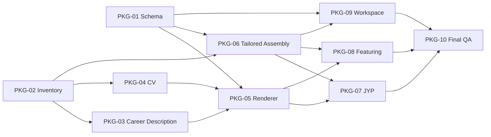

# Common 4-Document Package And Tailored Assembly

## Completion

- Common은 이력서·경력기술서·포트폴리오·CV 네 문서를 관리한다.
- JYP·피처링은 이력서·경력기술서·포트폴리오를 회사별로 조립하고 CV는 `omitted`로
  명시했다.
- application registry·projection·workspace가 네 artifact의 mode·revision·route를 같은
  schema로 표시한다.
- Common과 두 pilot의 PDF preview를 생성하고 desktop·mobile·A4·text extraction을
  검증했다. 사용자 승인 전이므로 Common은 `review-ready`, pilot은 mutable 상태를 유지한다.

## Goal

Common에는 이력서·경력기술서·포트폴리오·CV 네 문서를 모두 유지한다. 회사별 지원본은
이력서·경력기술서·포트폴리오를 기본으로 조립하고 CV만 선택적으로 추가한다. 모든 문서는
`profile/`·`evidence/`의 동일한 사실과 claim을 소비하며 서로를 사실의 원본으로 삼지 않는다.

설계 owner는
[Resume Document Package Contract](../../../products/resume/document-package-contract.md)다.

## Current Gap

- application registry의 route와 UI revision이 Resume·Portfolio 두 surface에 고정되어 있다.
- 회사별 `content-draft.md`도 이력서·포트폴리오 문안만 소유한다.
- Common 경력기술서와 CV의 문안 owner·route·renderer·PDF가 아직 없다.
- application workspace와 Snapshot이 네 artifact의 선택·생략·revision을 표현하지 못한다.
- 경력 사실과 case는 존재하지만 네 문서별 깊이로 재사용할 stable assembly block이 없다.

## Task Map

| ID | Task | Depends on | 병렬 가능 | 완료 산출물 |
| --- | --- | --- | --- | --- |
| `PKG-01` | 범용 artifact schema·legacy migration | 없음 | `PKG-02`와 가능 | registry v2, validator, projection contract |
| `PKG-02` | Common 경력·성과 inventory와 문서별 배치 | 없음 | `PKG-01`과 가능 | claim/case selection matrix |
| `PKG-03` | Common 경력기술서 문안 owner 구성 | `PKG-02` | `PKG-04`와 가능 | career-description content draft |
| `PKG-04` | Common CV 문안 owner 구성 | `PKG-02` | `PKG-03`과 가능 | CV content draft와 locale 결정 |
| `PKG-05` | Common `/career`·`/cv` renderer·A4 shell | `PKG-01`, `PKG-03`, `PKG-04` | 일부 병렬 | local route와 print layout |
| `PKG-06` | 회사별 4종 assembly template·workflow | `PKG-01`, `PKG-02` | `PKG-05` 후반과 가능 | tailored template, skill, typed registries |
| `PKG-07` | JYP pilot package | `PKG-05`, `PKG-06` | `PKG-08`과 가능 | JYP 3종 기본 + CV 선택 기록 |
| `PKG-08` | 피처링 pilot package | `PKG-05`, `PKG-06` | `PKG-07`과 가능 | 피처링 3종 기본 + CV 선택 기록 |
| `PKG-09` | application workspace 4종 상태 표시 | `PKG-01`, `PKG-06` | pilot과 가능 | 문서별 mode·revision·route UI |
| `PKG-10` | PDF·Snapshot·회귀 검증 | `PKG-05`–`PKG-09` | 마지막 직렬 | Common/Pilot artifact 검증 결과 |

## PKG-01 — Generic Artifact Schema

### Changes

- `application-registry.yaml`의 `routes.resume/portfolio`와 개별 UI revision을 범용
  `artifacts`·`artifact_revisions` map으로 승격한다.
- artifact key는 `resume | career-description | portfolio | cv`로 제한한다.
- 회사별 artifact mode는 `common | tailored | omitted` 세 가지로 제한한다.
- Common의 4종 현재 상태는 별도 tracked manifest가 소유한다. application attempt registry에
  Common을 가짜 회사 record로 넣지 않는다.
- 기존 Resume·Portfolio만 있는 attempt는 의미를 보존한 채 migration한다. 값이 없는
  Career Description·CV를 제작 완료로 추정하지 않는다.
- projection builder·workspace validator·frontend projection type을 같은 schema version으로
  갱신한다.

### Files

- `wiki/products/resume/application-registry.yaml`
- `wiki/products/resume/application-lifecycle.md`
- `tools/build_application_projection.py`
- `tools/validate_workspace.py`
- `app/fe/app/applications/application-types.ts`
- `app/fe/app/applications/application-data.server.ts`

### Acceptance

- legacy attempt의 status·frozen Snapshot 의미가 바뀌지 않는다.
- JYP·피처링은 Resume·Portfolio route를 유지하면서 새 artifact map으로 읽힌다.
- `cv: omitted`이 오류가 아니라 명시적 정상 상태로 검증된다.
- registry projection 테스트와 workspace validator가 통과한다.

## PKG-02 — Common Content Inventory

### Changes

- 프로젝트 단위로 기간·역할·문제·판단·구현·검증·결과·공개 한계를 목록화한다.
- 각 항목을 `claim ID`, portfolio case ID, resume-depth, career-description-depth, CV-depth에
  연결한다.
- 같은 성과를 여러 독립 성과처럼 세는 중복과 회사·고객·provider 비공개 표현을 제거한다.
- 문서별로 포함·요약·제외를 표시하고 아직 근거가 부족한 항목은 `Unverified`로 남긴다.

### Candidate source

- `wiki/profile/canonical-baseline.md`
- `wiki/profile/career.md`
- `wiki/evidence/claims/*.yaml`
- `wiki/products/portfolio/cases/`
- `wiki/products/resume/backend-case-achievements.md`
- `wiki/products/resume/product-decision-achievements.md`

### Acceptance

- 모든 public 문장이 하나 이상의 claim 또는 stable career fact로 역추적된다.
- Thready·Backend Template·실시간 상담/주문·AI migration·결제·제품 운영 사례의 기여
  범위가 서로 섞이지 않는다.
- 네 문서에서 동일한 문단을 복사하지 않고 어떤 깊이로 소비할지 결정된다.

## PKG-03 — Common Career Description

### Structure

1. 경력 요약과 담당 범위
2. 최근 회사의 제품·프로젝트별 수행
3. 프로젝트마다 `문제 → 담당 범위 → 선택한 구조 → 구현 → 실패/검증 기준 → 결과`
4. 이전 경력의 주요 제품과 기술 판단
5. 기술 역량과 협업·운영 방식

### Acceptance

- 이력서 bullet의 단순 확대본이 아니다.
- 포트폴리오를 보지 않아도 실제 수행과 판단을 설명할 수 있다.
- 정량 근거가 없는 결과를 수치로 만들지 않는다.
- 한국 채용 문맥에서 어색한 번역투·AI식 추상명사를 제거한다.

## PKG-04 — Common CV

### Structure

- Identity and contact
- Professional summary
- Complete employment history
- Selected projects and responsibilities
- Skills
- Education
- Awards, certifications, patent, public activities

### Decisions

- CV와 영문 Resume를 같은 artifact로 취급하지 않는다.
- `locale`은 artifact 종류와 분리한다. 구현 시작 시 Common CV의 최초 locale과 EN 파생
  범위를 확정한다.
- 설득을 위한 case 깊이보다 빠짐없는 전체 chronology와 credential 정확성을 우선한다.

### Acceptance

- Common의 검증된 전체 경력·credential을 누락 없이 확인할 수 있다.
- 이력서보다 과장된 ownership·수치가 생기지 않는다.
- locale별 번역은 같은 claim strength를 유지한다.

## PKG-05 — Routes, Renderer, And Print

### Routes

```text
/resume
/career
/portfolio
/cv
```

- `/career`, `/cv`는 승인 전 local/noindex로 시작한다.
- renderer는 A4와 desktop browser에서 같은 콘텐츠 위계가 유지되게 한다.
- navigation 노출과 route 존재를 분리한다. route가 있다고 공개 메뉴에 자동 노출하지 않는다.
- print/PDF에는 web navigation·draft control·floating action을 제거한다.

### Acceptance

- desktop과 A4 100% scale에서 문장 잘림·고아 줄·겹침이 없다.
- 문서 너비와 typography가 기존 Resume·Portfolio의 검증된 visual contract를 해치지 않는다.
- PDF link와 text extraction이 정상이고 페이지마다 문서 종류가 분명하다.

## PKG-06 — Tailored Assembly

### Changes

- `tailored/_template/content-draft.md`에 경력기술서와 optional CV section을 추가한다.
- attempt README에 네 artifact의 `common | tailored | omitted` 선택을 기록한다.
- 회사별 route는 아래를 사용하되 CV가 omitted이면 route를 만들지 않는다.

```text
/resume/{company}
/career/{company}
/portfolio/{company}
/cv/{company}      # optional
```

- `tailor-resume` workflow가 네 artifact를 선택하고 manifest·PDF·Snapshot을 검증하도록
  확장한다.

### Acceptance

- 회사별 문안 owner와 typed content의 drift를 validator가 발견한다.
- CV를 만들지 않은 package가 정상적으로 승인·제출될 수 있다.
- Frozen attempt의 제출본을 현재 Common 변화로 덮어쓰지 않는다.

## PKG-07/08 — Pilot Applications

JYP와 피처링은 현재 `pre-apply / mutable`이므로 첫 migration 대상으로 사용한다.

- 두 package 모두 Resume·Career Description·Portfolio를 구성한다.
- CV는 JD·지원 채널 요구를 확인해 `common | tailored | omitted` 중 하나를 명시한다.
- 기존 `content-draft.md`의 문안 owner 지위를 유지한다.
- 사용자 승인 전 artifact state를 `approved`로 올리거나 PDF를 제출본으로 표시하지 않는다.
- 왓섭·MGRV처럼 frozen인 attempt와 GNA COMPANY처럼 종료된 attempt는 pilot에서 수정하지 않는다.

## PKG-09 — Application Workspace

- 지원 상세에서 네 artifact의 mode·route·revision·검증 상태를 같은 표로 보여준다.
- `omitted`는 경고색이나 누락 오류로 표시하지 않는다.
- Common에서 가져온 artifact와 회사별로 수정한 artifact를 텍스트로 구분한다.
- UI는 registry의 read-only projection이며 브라우저에서 canonical 값을 수정하지 않는다.

## PKG-10 — Verification And Delivery Gate

### Automated

- workspace validator
- registry/projection tests
- TypeScript typecheck
- frontend lint and production build
- `git diff --check`

### Visual

- Common 4종 desktop
- `/career`, `/cv` A4 print
- JYP·피처링 desktop·mobile·A4
- 긴 한국어/영문 제목과 줄바꿈
- PDF text extraction, contact·portfolio link

### Lifecycle

- mutable → approved checkpoint
- optional CV omitted package
- frozen Snapshot immutability
- legacy Resume·Portfolio-only attempt preservation

## Execution Groups



### Group 1 — Foundation

- Track A: `PKG-01`
- Track B: `PKG-02`

### Group 2 — Common Documents

- Track A: `PKG-03`
- Track B: `PKG-04`
- 합류: `PKG-05`

### Group 3 — Tailored Pilot

- Foundation: `PKG-06`
- Track A: `PKG-07`
- Track B: `PKG-08`
- 병렬 UI: `PKG-09`

### Group 4 — Closeout

- `PKG-10`

## Non-goals

- 새 사실·수치·ownership 생성
- 제출 완료된 frozen 지원본의 문안 재작성
- 범용 CMS·database·별도 backend 구축
- Common 문서를 공개 navigation에 즉시 노출
- 사용자 승인 없는 commit·production deployment·지원 제출
