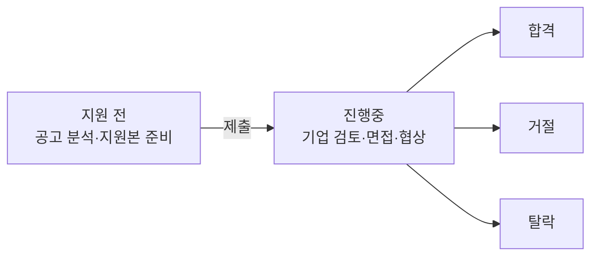

# Application Package Version Workspace

Status: implemented. UI projection은 tracked YAML에서 local JSON을 생성하고 server-only loader가 읽는 방식으로 확정했다.

## 1. Problem And Goal

현재 `/applications`는 active job posting shortlist, JD 분석, 지원 우선순위, 브라우저별 진행 메모를 관리한다. 반면 회사별 지원 package는 `company × JD × platform`의 한 application attempt를 기준으로 지원 전, 진행중, 합격, 거절, 탈락 상태와 제출본 동결을 관리한다.

두 책임을 한 데이터 모델로 합치면 posting freshness와 application lifecycle이 섞이고, localStorage 상태가 canonical package 상태처럼 보일 수 있다. 이 설계의 목표는 한 route 안에서 두 workflow를 빠르게 오가되 owner와 상태 의미를 분명히 유지하는 것이다.

- `공고 탐색`: 기존 shortlist 책임을 유지한다.
- `지원 관리`: [Tailored Application Lifecycle](../../../products/resume/application-lifecycle.md)의 read-only projection을 제공한다.
- canonical 변경은 agent/wiki workflow만 수행한다.
- Package revision과 제출 Snapshot의 관계를 한눈에 확인한다.

## 2. Entity And Responsibility Separation

| Entity | 의미 | Owner | `/applications` 책임 |
| --- | --- | --- | --- |
| `JobPosting` | 지원 후보 공고와 적합도 분석 | `app/fe/content/applications.json` | 탐색·filter·freshness·JD 판단 표시 |
| `PostingWorkspaceState` | 개인 shortlist 진행 메모 | browser localStorage | 기존 `공고 탐색` 안에서만 임시 저장 |
| `ApplicationAttempt` | 회사·JD·platform별 한 번의 지원 | `application-registry.yaml` | compact status와 read-only 목록·상세 projection |
| `PackageRevision` | coherent review checkpoint의 승인 가능한 문안 묶음 | lifecycle/local application docs | 현재 checkpoint와 history 표시 |
| `SurfaceRevision` | content와 독립적으로 바뀐 Resume 또는 Portfolio UI | lifecycle/local application docs | surface별 현재 revision 표시 |
| `Snapshot` | 제출 시점 Package와 두 UI revision의 immutable 조합 | lifecycle/local application docs | frozen 조합·검증 상태 표시 |

`JobPosting` 하나는 application이 없을 수 있고 여러 application attempt로 이어질 수 있다. 회사명·role 문자열로 join하지 않고, 연결이 확인된 경우에만 optional `postingId`를 사용한다. 지원하기로 결정한 순간 `ApplicationAttempt`를 만들고 status를 `pre-apply`로 시작한다.

기존 localStorage의 `watching/tailoring/ready/applied/interview/offer`는 과거 shortlist 편의 값이며 canonical status가 아니다. 구현 시 `watching`은 공고 탐색 메모로 남기고, `tailoring/ready`는 `pre-apply`, `applied/interview/offer`는 `in-progress`로 화면상 대응하되 canonical registry를 자동 수정하지 않는다.

## 3. Compact Status And Revision Schema

YAGNI를 우선해 lifecycle과 stage를 이중 관리하지 않고 사용자 관점 status 하나만 둔다. 세부 진행 위치는 `tracking` 자유 문구로 표시한다. edit log, diff engine, database, artifact hash는 만들지 않는다.



```ts
type ApplicationAttemptProjection = {
  id: string;
  postingId?: string;
  company: string;
  role: string;
  status: "pre-apply" | "in-progress" | "accepted" | "declined" | "rejected" | "unknown";
  tracking?: string;
  artifactState: "mutable" | "approved" | "frozen" | "unknown";
  sourcePath: string;
  lastConfirmed?: string;
  resumeRoute?: string;
  portfolioRoute?: string;
  current?: PackageCheckpoint;
  snapshot?: SubmissionSnapshot;
  workSession?: ApplicationWorkSession;
};

type ApplicationWorkSession = {
  state: "active" | "waiting-review" | "paused" | "complete" | "unknown";
  scope: string;
  lastSynced?: string;
  nextAction?: string;
};

type PackageCheckpoint = {
  kind?: "checkpoint" | "legacy-import";
  packageRevision?: number;
  resumeUiRevision?: number;
  portfolioUiRevision?: number;
  checkpointAt?: string;
};

type SubmissionSnapshot = {
  id?: string;
  verification: "unknown" | "partial" | "verified";
  capturedAt?: string;
  submittedAt?: string;
  packageRevision?: number;
  resumeUiRevision?: number;
  portfolioUiRevision?: number;
  artifactRefs?: readonly string[];
};
```

- `pre-apply`: 지원하기로 결정했고 아직 제출하지 않은 상태. 문안 작성·사용자 승인·제출 준비를 모두 포함한다.
- `in-progress`: 제출 이후 기업 검토·면접·처우 협상을 모두 포함한다.
- `accepted`: 최종 오퍼를 수락했다.
- `declined`: 오퍼 또는 후속 제안을 사용자가 받지 않기로 했다.
- `rejected`: 회사 결정이나 채용 종료로 전형이 더 진행되지 않는다.
- `pre-apply`, `in-progress`만 현재 진행 대상으로 본다. 나머지 세 status는 종료 결과이며 별도 lifecycle 값을 저장하지 않는다.
- `unknown`은 여섯 번째 사용자 상태가 아니라 과거 기록을 추정하지 않기 위한 내부 sentinel이며 화면에는 `상태 미확인`으로만 표시한다.
- 공고 탐색 단계에서 단순 마감된 `JobPosting`은 application `rejected`로 자동 변환하지 않는다.
- Artifact state는 제출본의 수정 가능성과 동결 여부를 지키는 내부 무결성 축으로 남기며 사용자 status를 늘리지 않는다.

- Revision 번호가 없는 legacy application은 `0`이나 추정 `1`을 쓰지 않고 값을 비운다.
- `sourcePath`는 owner-only UI에서 복사할 logical repo path다. 절대경로를 저장하지 않는다.
- Snapshot은 제출 이후 수정하지 않는다. 추가 제출은 새 Snapshot 또는 재지원용 새 application attempt로 기록한다.
- `workSession`은 application status와 별개인 portable handoff다. raw session ID나 provider 이름은 저장하지 않는다.

## 4. Revision Rules

1. Draft의 모든 문장 수정에는 revision을 올리지 않는다.
2. 사용자 review가 끝나 하나의 coherent checkpoint가 되었을 때 `Package rN`을 발급한다.
3. Checkpoint 이후 content가 바뀌어 다시 review를 통과하면 `Package`만 증가한다.
4. Content는 그대로이고 Resume layout·component·typography가 독립 변경되면 `Resume UI rN`만 증가한다.
5. Content는 그대로이고 Portfolio UI가 독립 변경되면 `Portfolio UI rN`만 증가한다.
6. 제출 시점에 `Package + Resume UI + Portfolio UI` 조합을 Snapshot으로 pin한다.
7. Frozen Snapshot 이후 current route가 발전해도 기존 Snapshot 조합은 바뀌지 않는다.

Examples:

- JYP 문안 승인과 두 surface visual verification 완료: `Package r1 · Resume UI r1 · Portfolio UI r1`.
- 이후 이력서 spacing만 재검증: `Package r1 · Resume UI r2 · Portfolio UI r1`.
- 문안 변경 후 재승인: `Package r2 · Resume UI r2 · Portfolio UI r1`.
- 이 조합으로 제출: `Snapshot S1 = Package r2 + Resume UI r2 + Portfolio UI r1`.
- 피처링도 최초 승인·visual verification checkpoint에서 같은 방식으로 baseline을 시작한다.
- 왓섭: `in-progress / frozen / legacy-import`, tracking은 `기업 검토 중`. 현재 제출 route는 표시하되 exact revision·submitted artifact는 `unknown`.
- MGRV: `rejected / frozen / legacy-import`, tracking은 `서류 전형 종료`. 보존 파일은 candidate로만 표시하고 exact submitted artifact로 추정하지 않는다.

## 5. UI Information Architecture

### Route And Tabs

`/applications`의 compact page header 아래에 상단 tab 두 개를 둔다.

- `공고 탐색`: 기존 posting shortlist와 분석 detail을 유지한다.
- `지원 관리`: application attempt와 revision·Snapshot을 표시한다.

Tabs는 route 내부 view state이며 서로의 filter와 selection을 보존한다. URL query 또는 hash로 현재 tab을 복원할 수 있어야 한다.

### 지원 관리 · Desktop

기존 surface vocabulary를 이어받는 master-detail 구조를 사용한다.

- Left master list: 320–380px, company·role·status·tracking·last confirmed.
- Right detail: 상태와 next action → 작업 세션 handoff → current checkpoint → Resume/Portfolio surfaces → frozen Snapshot → history → source/provenance 순서.
- Row와 detail section은 rules와 whitespace로 구분한다. Card grid를 만들지 않는다.

### List Row

Primary는 company와 role이다. Status는 `지원 전·진행중·합격·거절·탈락` 중 하나로 짧게 표시하고, tracking과 version은 `기업 검토 중 · Package rN · R rN · P rN` 형태의 secondary metadata로 둔다. Artifact state는 Snapshot과 제출본 보호가 필요한 detail에서만 보여준다. Unknown은 빈칸이 아니라 `상태 미확인`, `버전 미상`으로 명시한다.

### Detail States

- `pre-apply`: 다음 review checkpoint와 제출 전 검증 상태를 안내한다. 승인 여부는 artifact state로 표시한다.
- `in-progress`: frozen Snapshot을 detail 상단 가까이에 표시하고 tracking으로 기업 검토·면접·협상 위치를 설명한다.
- `accepted`: 합격과 오퍼 수락 완료를 표시하고 제출 Snapshot을 보존한다.
- `declined`: 사용자가 제안을 거절한 상태와 당시 tracking을 표시한다.
- `rejected`: 회사 결정으로 종료된 상태와 frozen/unknown Snapshot을 표시하고 active source 금지를 명시한다.
- `unknown`: status·revision을 추정하지 않고 확인이 필요한 필드를 나열한다.

## 6. Visual Hierarchy

Product register의 restrained 전략을 유지한다.

- Scene: 낮 시간 데스크에서 한 명의 owner가 여러 지원 상태를 빠르게 대조하고 다음 행동을 정하는 조용한 작업 화면.
- Anchor references: Linear의 dense issue list, GitHub Actions의 immutable run history, 기존 `/applications` master-detail.
- Monochrome surface와 1px rules가 구조를 만든다.
- Semantic color는 small status text·dot·warning rule에만 사용하며 색만으로 상태를 전달하지 않는다.
- Version은 headline, pill, badge가 아니라 secondary mono metadata다.
- Hero metric, decorative version badge, repeated cards, shadow, gradient, decorative motion은 사용하지 않는다.
- Summary count가 필요하면 filter 결과 옆 inline metadata로 두고 주요 시각 요소로 키우지 않는다.

## 7. Read-Only Interactions

허용 interaction:

- `공고 탐색` / `지원 관리` tab 전환
- company·role 검색, status filter
- master row 선택과 mobile detail 진입/복귀
- Resume·Portfolio route 열기
- logical source path 복사와 완료 feedback
- revision history reveal/collapse
- Snapshot artifact가 verified이고 현재 workspace에서 사용 가능할 때 열기

금지 interaction:

- Application status·revision·Snapshot을 browser에서 수정
- localStorage에 package canonical state 저장
- artifact upload·삭제·overwrite
- unknown 값을 UI action으로 추정 확정

`공고 탐색`의 기존 localStorage 메모는 shortlist convenience로만 남고 `지원 관리` projection에는 영향을 주지 않는다.

## 8. Data Ownership And Projection

`wiki/products/resume/application-registry.yaml`이 compact application status와 revision metadata의 tracked canonical owner다. [Tailored Application Lifecycle](../../../products/resume/application-lifecycle.md)은 상태·버전·Snapshot 규칙만 소유한다. Ignored `tailored/` detail과 제출 artifact는 local provenance이며 clean clone의 필수 dependency가 아니다.

UI projection은 아래 한 방향으로만 생성한다.

```text
application-registry.yaml
  -> tools/build_application_projection.py
  -> output/application-workspace/application-attempts.json
  -> server-only loader
  -> /applications 지원 관리 tab
```

- generated JSON은 local derived artifact이며 hand-edit하거나 Git에 추가하지 않는다.
- server-only loader는 local JSON이 없을 때 빈 상태를 반환해 clean clone build를 깨뜨리지 않는다.
- `/applications`는 `NODE_ENV=production`에서 `notFound()`로 종료한다. `noindex`는 접근 제어로 사용하지 않는다.
- Private note, recruiter 대화, 연봉, ignored artifact 원문은 registry와 client bundle에 포함하지 않는다.
- validator는 status enum, unique ID, terminal status, frozen Snapshot, projection drift를 검사한다.

## 9. Empty, Error, And Integrity States

- Empty: `관리 중인 지원이 없습니다`와 함께 agent/wiki workflow에서 application을 시작한다는 안내만 제공한다. 생성 button은 두지 않는다.
- Projection error: 목록을 임의 fallback하지 않고 canonical source를 읽지 못했음을 표시한다.
- Missing local artifact: metadata는 표시하되 `이 workspace에 local artifact 없음` 상태로 link를 비활성화한다.
- Route unavailable: clean clone·local draft 미구현을 구분해 표시한다.
- Frozen: Snapshot 조합과 captured time을 표시하고 current surface와 분리한다.
- Legacy unknown: `legacy-import · exact revision unknown`을 유지하며 candidate artifact를 submitted artifact로 승격하지 않는다.

## 10. Accessibility And Responsive

- Tabs는 `tablist/tab/tabpanel`, arrow-key navigation, `aria-selected`를 제공한다.
- Selected master row는 색 외에 marker와 `aria-current`로 구분한다.
- Status는 text label과 tone을 함께 사용한다.
- Source copy 결과는 polite live region으로 전달한다.
- History control은 native button과 `aria-expanded`를 사용한다.
- 모든 interactive target은 최소 44×44px이며 visible focus를 유지한다.
- Desktop은 master-detail, mobile은 list → detail의 단일 column 전환과 명확한 back action을 사용한다.
- Mobile detail에서도 active tab과 filter state를 보존한다.
- Transition은 150–250ms의 state feedback만 사용하고 reduced motion을 지원한다.

## 11. Explicit Non-goals

- Browser에서 wiki·JSON·README를 수정하는 CMS
- Package state를 localStorage canonical로 전환
- Database, backend service, authentication 구축
- Resume·Portfolio 문안 또는 UI 자체 편집
- Per-edit history, visual diff, semantic diff, SHA manifest
- Submitted artifact 자동 추정이나 MGRV·왓섭 revision 역산
- Posting과 ApplicationAttempt를 하나의 entity로 통합
- Ignored local artifact를 clean clone 필수 dependency로 전환

## 12. Expected Implementation Scope

예상 파일:

- `app/fe/app/applications/application-workspace.tsx`: tab shell과 기존 `공고 탐색` 보존
- `app/fe/app/applications/*`: `지원 관리` master list·detail component
- `app/fe/content/applications.ts`: posting adapter 책임 유지, package projection과 직접 혼합하지 않음
- server-only projection loader와 client-safe application attempt type
- `wiki/products/resume/application-registry.yaml`: canonical status·revision metadata
- `wiki/products/resume/application-lifecycle.md`: status·revision·Snapshot contract
- local `wiki/products/resume/tailored/*/README.md`: detail provenance와 confirmed revision
- `tools/build_application_projection.py`: local JSON 생성과 schema·frozen contract 확인
- `tools/validate_workspace.py`: registry와 projection contract 연결 검증

Acceptance criteria:

1. `/applications`에 `공고 탐색`과 `지원 관리` tab이 있고 keyboard·URL restore가 동작한다.
2. `공고 탐색`의 posting data, filter, freshness, localStorage 책임은 유지된다.
3. `지원 관리`는 canonical status registry의 read-only projection이며 mutation control이 없다.
4. JYP·피처링은 baseline 전 `revision 미발급`, 승인·visual verification 후 각 `r1`을 표시한다.
5. MGRV·왓섭은 `legacy-import`와 unknown revision/artifact를 추정 없이 표시한다.
6. `in-progress`와 종료 status detail은 frozen Snapshot과 current surface를 구분한다.
7. Empty, projection error, route unavailable, frozen, legacy unknown 상태가 구현된다.
8. Clean clone에서 ignored detail이 없어도 build와 지원 목록이 깨지지 않는다.
9. Private local data가 client bundle에 포함되지 않는다.
10. Production `/applications`는 404이고 local development에서만 workspace가 열린다.
11. Mobile list/detail, focus order, tab semantics, status non-color cue를 구현한다.
12. lint, build, workspace validator와 production 404·client artifact privacy 검사가 통과한다. Desktop/mobile visual QA는 브라우저 연결이 가능한 세션에서 별도로 완료한다.

## 13. Final Decisions

- Status owner: tracked `application-registry.yaml`
- Rules owner: `application-lifecycle.md`
- Detail provenance: ignored `tailored/{company}/{attempt}/`
- Projection: local generated JSON + server-only loader
- Production exposure: `/applications` 404
- UI: tabs, restrained master-detail, read-only support management
- Versioning: coherent `Package rN`, independent surface revisions, immutable `Snapshot S{n}`

Implementation reference: `impeccable`의 Product register, `layout`, `harden`, `polish` 기준을 적용한다.
