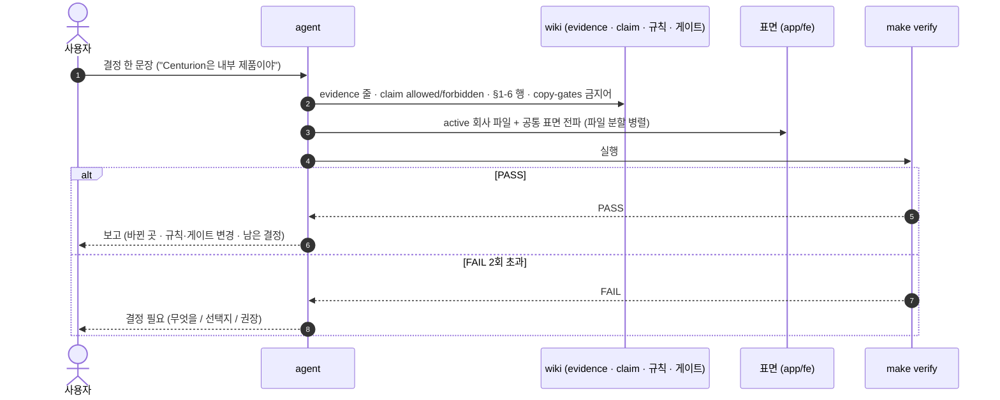
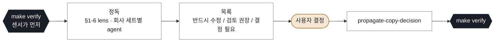
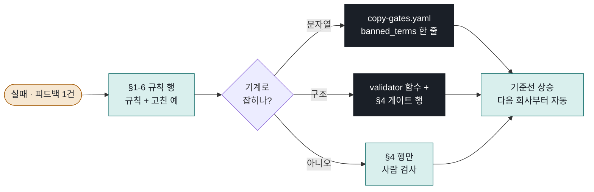

# Application Copy Harness — 이렇게 관리한다

한 문장: **결정은 SoT에 먼저 쓰고, 표면으로 뿌리고, `make verify`로 닫는다. 실패는 규칙 행 + 게이트로 적립한다.**

설계 배경은 [design-v1](../backlog/agent-harness-operationalization/design-v1.md), 표현 규칙은 [application-copy-standard](application-copy-standard.md), 공개 범위는 [public-safety](public-safety.md)가 소유한다. 이 문서는 **흐름과 owner**만 말한다.

## 1. 전체 흐름

```mermaid
flowchart TB
    classDef human fill:#f6e7d2,stroke:#a8600e,color:#1a1f27
    classDef sot fill:#d9efed,stroke:#0e6b68,color:#1a1f27
    classDef surf fill:#ffffff,stroke:#7a8494,color:#1a1f27
    classDef gate fill:#1a1f27,stroke:#1a1f27,color:#ffffff

    U([사용자 결정 한 문장]):::human

    subgraph SOT["SoT — 먼저 쓴다 (순서 고정)"]
        direction TB
        E[evidence<br/>User-confirmed 날짜]:::sot --> C[claim<br/>statement · allowed · forbidden]:::sot
        C --> R[규칙 행<br/>copy-standard §1-6 · public-safety]:::sot
        R --> G[게이트 데이터<br/>copy-gates.yaml]:::sot
    end

    subgraph SURF["표면 — copy-surfaces.yaml 이 목록을 소유"]
        direction LR
        S1[resumes/{co}.ts]:::surf
        S2[documents/{co}.ts]:::surf
        S3[portfolios/{co}.ts]:::surf
        S4[documents/common.ts<br/>resume-view.tsx<br/>lib/cases.ts]:::surf
    end

    V{{make verify<br/>validator → tsc → route 200}}:::gate
    REP[보고<br/>바뀐 곳 · 검증 · 남은 결정]:::surf
    Q([결정 필요<br/>무엇을 / 선택지 / 권장]):::human

    U --> E
    G --> SURF
    SURF --> V
    V -- PASS --> REP
    V -- "FAIL · 수정 2회 초과" --> Q
    Q -.-> U
```

- 왼쪽 위에서 오른쪽 아래로 한 방향이다. **표면을 먼저 고치고 SoT를 나중에 맞추는 일은 없다.**
- active 표면만 전파·검사한다. registry `artifact_state: frozen` 회사는 스냅샷이라 건드리지 않는다 (게이트 13이 막는다).
- 같은 파일을 두 agent가 만지지 않는다. 표면은 파일 단위로 나눠 병렬로 고쳐도 된다.

## 2. 세 루프

### 결정 전파 — [propagate-copy-decision](../../skills/propagate-copy-decision/SKILL.md)



### 전수 검토 — [review-application-copy](../../skills/review-application-copy/SKILL.md)



파일은 고치지 않는다. 결정 없이 수정 단계로 넘어가지 않는다.

### 래칫 — 실패를 통제로 바꾼다



**같은 작업 안에서** 한다. 규칙 갱신 없이 문안만 고치면 미완료다. 게이트 하나는 규칙 행 하나와 짝이고, 행이 지워지면 게이트도 지운다.

## 3. Owner 표

| 무엇 | 파일 | 바꾸는 때 |
| --- | --- | --- |
| 표현 규칙과 게이트 목록 | [application-copy-standard.md](application-copy-standard.md) §1-6 · §4 | 결정·피드백이 있을 때마다 행 추가 |
| 공개 범위 (내부 제품명·고객사·provider) | [public-safety.md](public-safety.md) | 공개 여부 결정 |
| 게이트 데이터 (금지어·축 단어·문장 수·frozen) | [copy-gates.yaml](copy-gates.yaml) | 규칙 행과 같은 작업 |
| 검사 대상 표면 목록 · active 조건 | [copy-surfaces.yaml](../products/site/copy-surfaces.yaml) | 표면 파일이 생기거나 없어질 때 |
| 회사별 상태 · frozen · `header_role` | [application-registry.yaml](../products/resume/application-registry.yaml) | 지원 상태가 바뀔 때 |
| 검사 코드 | [validate_workspace.py](../../tools/validate_workspace.py) | 구조 게이트 추가·삭제 |
| 실행 순서 · 기록 | [verify.py](../../tools/verify.py) · `Makefile` | 거의 안 바뀐다 |
| 오늘 결정의 누적 | copy-standard §1-6 표 (날짜 · 고친 예) | 래칫 로그 역할 |

## 4. 명령

```bash
make verify                      # scope 자동. wiki 변경 → validator / app/fe 변경 → + tsc + active route 200
make verify-all
make verify ARGS=--allow-frozen  # 게이트 13 해제. 사용자의 명시적 결정이 있을 때만
```

결과는 한 줄 요약과 `output/harness/runs/{ts}.json`. 문안 작업의 완료 정의는 **verify PASS + active route 200 + 보고** 세 가지다.

## 5. 지금 자동인 것 / 사람인 것

| 게이트 | 검사 | 주체 |
| --- | --- | --- |
| 11 | 성과 제목 4개에 축 단어 4개 이상 | 자동 |
| 12 | 공개 금지어 0건 | 자동 |
| 13 | frozen 회사 표면 불변 | 자동 (FAIL) |
| 14 | 헤더 직함 = registry `header_role` | 자동 |
| 16 | hero 소개 2문장 이하 | 자동 |
| 15 | 공유 사실 문자열 일치 (재오픈 37→11, 약 94%) | P1 |
| 1~10 | 15초 문장 세 사실, 재직 사유, 번역투, 문제→판단→경계→결과 등 | 사람 (review skill lens) |

## 관련

- [design-v1](../backlog/agent-harness-operationalization/design-v1.md) — 왜 이렇게 했는가, 6계층 갭
- [AGENTS.md](../../AGENTS.md) — 검증 · 래칫 절
- `/_map` — 로컬 지도. 회사 × (포폴·이력서·CV·경력기술서)와 registry 상태
